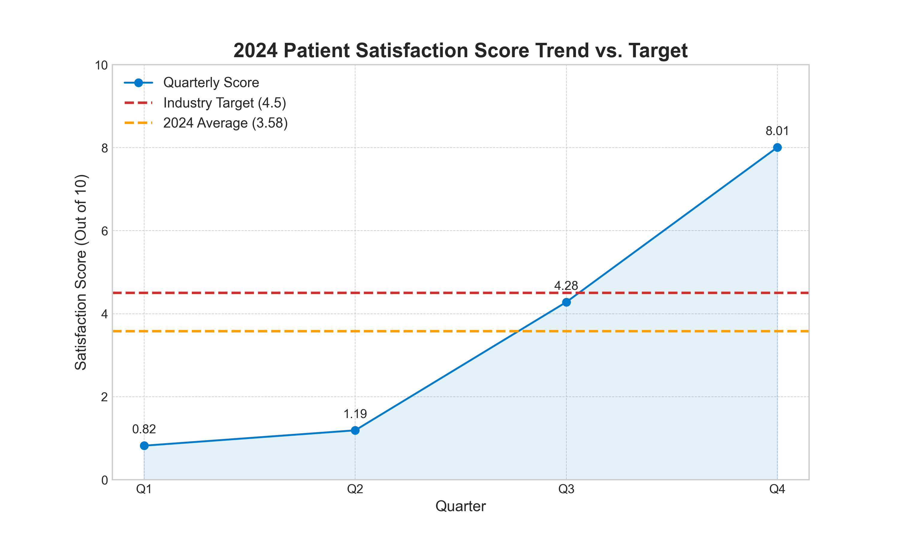

# Healthcare Patient Satisfaction Analysis: 2024 Performance Review

## 1. Executive Summary

This analysis investigates the concerning trend in patient satisfaction scores throughout 2024. While our **annual average score is 3.58**, significantly below the industry benchmark of **4.5**, the quarterly data reveals a powerful story of dramatic improvement. The first half of the year showed critically low performance, but strategic changes in the second half led to a remarkable recovery, with Q4 performance far exceeding the industry target.

This report outlines our key findings and provides data-driven recommendations focused on **improving service quality and wait times** to sustain this positive momentum and consistently exceed the industry benchmark.

---

## 2. Quarterly Performance Visualization

The chart below illustrates the stark contrast between the first and second halves of 2024.

---

## 3. Key Findings

1.  **A Tale of Two Halves:** The year was split into two distinct periods. H1 (Q1: 0.82, Q2: 1.19) represented a period of severe underperformance that requires investigation. In contrast, H2 (Q3: 4.28, Q4: 8.01) shows a phenomenal turnaround, indicating that initiatives implemented mid-year were highly effective.

2.  **Average Score is Misleading:** The annual average of **3.58** masks the true story. It is not a reflection of consistent, mediocre performance but rather an average of a poor start and an excellent finish. The key insight is not that we failed to meet the target, but that we have discovered a formula for success in the latter half of the year.

3.  **Momentum Exceeds Target:** Q4's score of **8.01** is not just an improvement; it's nearly double the industry target of 4.5. This proves that the organization is capable of achieving excellence in patient satisfaction.

---

## 4. Business Implications

* **Risk of Patient Churn:** The abysmal scores in H1 likely damaged patient trust and could have led to patient attrition. We must focus on rebuilding that trust.
* **Operational Success Model:** The strong H2 performance provides a clear internal benchmark and a model for success. Understanding what changed is the key to our future strategy.
* **Competitive Advantage:** Sustaining Q4's level of performance will not only meet the benchmark but will position us as an industry leader in patient experience, directly impacting patient retention and attracting new patients.

---

## 5. Recommendations to Reach and Exceed the 4.5 Target

The solution lies in understanding and standardizing the successful changes made in H2. Our recommendations focus on **improving service quality and wait times**:

1.  **Identify and Scale H2 Initiatives:** The immediate priority is to conduct a deep-dive analysis into the operational changes made between Q2 and Q3.
    * **Action:** Form a task force to interview department heads and front-line staff to pinpoint changes in patient scheduling, staff training, communication protocols, or clinical workflows that contributed to the drastic improvement.

2.  **Optimize Patient Flow and Reduce Wait Times:** Long wait times are a primary driver of dissatisfaction.
    * **Action:** Implement a real-time queue management system that provides patients with accurate wait time estimates via SMS.
    * **Action:** Pilot a "fast-track" check-in process for routine appointments and leverage telehealth services to reduce in-person waiting room congestion.

3.  **Enhance Service Quality Through Proactive Feedback:** Don't wait for quarterly reports to identify issues.
    * **Action:** Deploy a real-time feedback system (e.g., a simple post-visit SMS or email survey) to capture patient sentiment immediately. This allows for rapid service recovery and identifies staff training needs.

By standardizing the successful practices from H2 and investing in technology to manage wait times and service quality, we can ensure that the full-year average for 2025 significantly exceeds the 4.5 industry target.

---
*For questions regarding this analysis, please contact the analyst team.*
*Analyst Contact: **24f1001393@ds.study.iitm.ac.in***